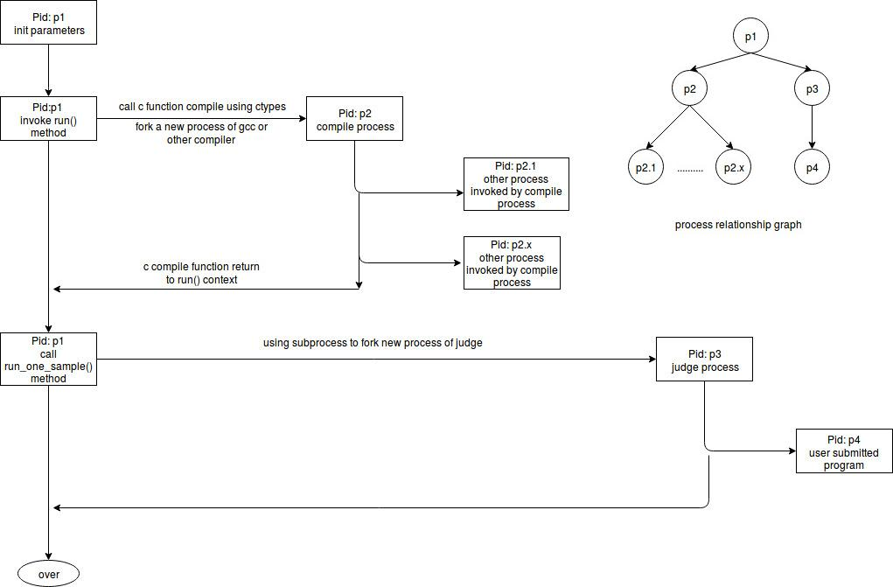

LambdaOJ2
=========

## Overview

LambdaOJ2 is a libaray for online judge system. It consists of two parts:

* kernel(written in pure C)
* python3 API(written in python, with the help of ctypes and subprocess)

An online judge system need to strictly control the resource(time and memory) of the program submitted by users. Security is also very important because we are going to run any code submitted by users.

LambdaOJ2 uses rlimit to control program resource(cputime, virtual memory, output file size) during runtime, and uses ptrace to trace each system call of the program to ensure security. Details can be understood from the code(`run_task.c`).

## Kernel

The kernel part takes the charge of compiling code, and running the code under monitoring with limited resources.

### C API

The `liblambdaOJ.so` provide two functons as API:
* `int compile(char *source_code, char* exe_file, int compiler, char* err_log)`
  + `source_code`: the full path of the code need to be test
  + `exe_file`: the full path of the executable file generated by compiler
  + `compiler`: the code of supported compilers, defined in `compile.h` as macros, details are shown below
  + `err_log`: the full path of error message generated by compiler if failed(notice we close all warnings in compile command, so if err_log is not empty, compile must be failed)
  + return `-1` if compile failed, else return `0`
* `void run_task(char* exe_file, char* input_file, char* output_file, int max_cpu_time_limit, int max_memory_limit, struct task_result* tr)`
  + `exe_file`: the full path of the executable program need to test
  + `input_file`: the full path of the input_file, as stdin to the executable program
  + `output_file`: the full path of the output_file, as stdout to the executable program
  + `max_cpu_time_limit`: the problem's time limit, in seconds
  + `max_memory_limit`: the problem's memory limit, in KBytes
  + `tr`: the pointer of a struct task_result object, which contains the result

`struct task_result` is defined in `run_task.h`, it contains three fields:
* `int final_result`: the state code of the task, defined as macros in `run_task.h`, details are shown below
* `long time_used`: Total used cpu time of user and system, in ms, only available when final_result is `TASK_ALL_NORMAL`
* `mem_used`: Max RSS Meomory of the program, in KBytes, only available when final_result is `TASK_ALL_NORMAL`

Supportted Compiler | Compile command | Code(macros in `compile.h`)
--------------------|---------------|------------------------------
c89 | `gcc -std=c89 -static -O2 -w -lm -o output` | `C89`
c99 | `gcc -std=c99 -static -O2 -w -lm -o output` | `C99`
c11 | `gcc -std=c11 -static -O2 -w -lm -o output` | `C11`
c++03| `g++ -std=c++03 -static -O2 -w -lm -o output` | `CPP03`
c++11| `g++ -std=c++03 -static -O2 -w -lm -o output` | `CPP11`

final_result(macros in `run_task.h`) | Comments
-------------|----------------------------------------------
`TASK_ALL_NORMAL` | code exit normally, wait to check output to determine WA of AC
`TASK_TIME_LIMIT_EXCEEDED` | failed becauase of TLE
`TASK_MEMORY_LIMIT_EXCEEDED`| failed becauase of MLE
`TASK_OUTPUT_LIMIT_EXCEEDED`| failed becauase of OLE
`TASK_BAD_SYSCALL`| failed because of invoking unsafe system call
`TASK_RUN_TIME_ERROR`| failed because of runtime error
`TASK_UNKNOWN_RESULT`| failed because of unknown reason

### Syscall blacklist

The syscall blacklist is defined in `run_task.c`. Since lambdaOJ2 only works under linux 64bit system, it is defined as `int SYSCALL_BLACK_LIST[329]`.

* `int SYSCALL_BLACK_LIST[i] == 0` means the syscall is safe
* `int SYSCALL_BLACK_LIST[i] == 1` means the syscall is banned

If you can modify this list,  you have to recompile the project.

### judge

`judge` is the executable program provided by the kernel. It use `run_task` to test a program, and print the result to stdout. `judge` takes five command line arguments, shown below:

Arg     |Comments
--------|------------
argv[1] | the full path of executable program need to be tested
argv[2] | the full path of input file as stdin for the testing executable program
argv[3] | the full path of output file as stdout for the testing executable program
argv[4] | integer, in seconds, the time limit of the testing executable program
argv[5] | integer, in KBytes,  the memory limit of the testing executable program

The stdout is a string with format(python style) `"%d,%d,%d" % (final_result, time_used, mem_used)`.

## Python3 API

The python package `lambdaOJ2` provide a abstract class `Judge` for developer. You can refer to the doc string of `Judge`.

`lambdaOJ2` provide flexibility by `abstract base class(python3)`, the main reasons are:
* the correctness of some problems can not be tested by simply comparing output and std answer
* different application may have different architecture, the input ans std_answer may be stored in different places

### inherit

To use `lambdaOJ2` in practice, you should inherit `Judge` and implement the abstractmethod to meet requirements below:
* `def check_answer(self, std_answer:string, submit_output:string) -> bool`
  + `std_answer`: the full path of standard answer
  + `submit_output`: the full path of the output file of the submitted code
  + return `True` if submitted code is right, else return `True`
* `def get_test_input_by_id(self, id: int) -> string`
  + `id`: the id of the test sample
  + return a string, full path of the input of this test round
* `get_std_answer_by_id(self, id: int) -> string`:
  + `id`: the id of the test sample
  + return a string, full path of the standard answer of this test round

### initialized

The derived class of `Judge` can only be initialized using keyword arguments:

Keyword Argument | Comments
-----------------|---------------------
`judge_exe`| string(full path of judge executable file)
`problem_id`| string(can be used to determine the input and std_answer path)
`work_dir`| string(full path of the temp dir for judging)
`compiler_name`| string, can only be one of keys of .consts.COMPILERS
`source_code`| string, (full path of the code submitted)
`sample_num`| integer(the number of total test sample)
`mem_limit`| integer(the memory limit, in KBytes)
`time_limit`| integer(the time limit, in Seconds)

### run

`Judge` provide a method `run` to finish all the jobs.

the return value of `def run(self)` can be:
* if compile ok, type structure is `(lambdaOJ2.consts.COMPILE_OK:int, [(task_status:int, time_used:int, mem_used:int)])`, `time_used` in ms, `mem_used` in KBytes
* if compile failed, `(lambdaOJ2.consts.COMPILE_ERROR:int, error_message:string)`

task_status(defined in lambdaOJ2.consts) | comments
-------------------------|--------------------------
`ACCEPTED` | all right, accepted
`WRONG_ANSWER`| program exit normally, however the output is not right
`TIME_LIMIT_EXCEEDED`|time limit exceeded
`MEMORY_LIMIT_EXCEEDED`|meory limit exceeded
`OUTPUT_LIMIT_EXCEEDED`|output limit exceeded
`BAD_SYSCALL`|invoke unsafe system call
`RUN_TIME_ERROR`|runtime error
`UNKNOWN_RESULT`| others

### Runtime Process Relationship Graph

## Example

Please refer [tests/test.py](https://github.com/kainwen/lambdaOJ2/blob/master/tests/test.py).
